# SSL Admin Inductions 2026

## Author : Abhinav Mathew

### Note : this documentation is only based on what I wrote.

## 1. Initial Setup

**1. Local Shell Configuration**
To make accessing the remote VM easier, I opened the local Zsh configuration file using `micro ~/.zshrc` to add a custom SSH shortcut.

<details>
<summary> View Screenshot</summary>


</details>
<br>

**2. Creating an SSH Alias**
I added an alias named `enter_sandman`. This shortcut executes the full SSH command, using a specific private key to log into the target VM at `mathew@74.243.216.112`.

<details>
<summary> View Screenshot</summary>


</details>
<br>

**3. Connecting to the VM**
By running the new `enter_sandman` command, I can instantly initiate a secure shell connection to the remote Ubuntu environment.

<details>
<summary> View Screenshot</summary>


</details>
<br>

**4. System Package Updates**
Once logged in, the first step for system security is to update the system packages. I ran `sudo apt update && sudo apt upgrade` to fetch and install the latest package versions.

<details>
<summary> View Screenshot</summary>


</details>
<br>

**5. Installing Unattended Upgrades**
To ensure the system always receives the latest security updates automatically, I started by installing the required package using `sudo apt install unattended-upgrades`.

<details>
<summary> View Screenshot</summary>


</details>
<br>

**6. Installing a Text Editor**
To make editing configuration files on the server easier, I installed the `micro` text editor using `sudo apt install micro`.

<details>
<summary> View Screenshot</summary>


</details>
<br>

**7. Accessing Update Configurations**
I then opened the core configuration file for automatic updates by running `micro /etc/apt/apt.conf.d/50unattended-upgrades`.

<details>
<summary> View Screenshot</summary>


</details>
<br>

**8. Enabling Security Origins**
Inside this file, I ensured the `"${distro_id}:${distro_codename}-security"` line within the `Allowed-Origins` block was active. This tells the system to automatically apply critical security patches.

<details>
<summary> View Screenshot</summary>


</details>
<br>

**9. Scheduling the Upgrades**
Next, I opened the periodic upgrades scheduling file by executing `micro /etc/apt/apt.conf.d/20auto-upgrades`.

<details>
<summary> View Screenshot</summary>


</details>
<br>

**10. Finalizing Periodic Rules**
Finally, I configured the `APT::Periodic` parameters. Setting `Update-Package-Lists` and `Unattended-Upgrade` to `"1"` ensures daily package list updates and the automatic installation of those security updates.

<details>
<summary> View Screenshot</summary>


</details>
<br>

<br>

## 2. Enhanced SSH Security

**1. Securing SSH Configuration**
To lock down the server, I edited the SSH daemon configuration file to disable root login , disable password-based authentication, and explicitly enable public key authentication. Additionally, I restricted SSH access to a specific IP range (`172.21.*.*`) for the user `mathew` using the `Match Address` and `AllowUsers` directives.

<details>
<summary> View Screenshot</summary>


</details>
<br>

**2. Testing the Configuration**
Before applying the changes, I ran `sudo sshd -t` to test the configuration file for any syntax errors to prevent locking myself out.

<details>
<summary> View Screenshot</summary>


</details>
<br>

**3. Restarting the SSH Service**
With the configuration verified, I restarted the SSH daemon using `sudo systemctl restart ssh` to apply the new security rules.

<details>
<summary> View Screenshot</summary>


</details>
<br>

**4. Verifying Access**
I opened a new terminal session and executed the SSH command to ensure I could still successfully log into the VM with the new restrictions in place.

<details>
<summary> View Screenshot</summary>


</details>
<br>

**5. Installing Fail2ban**
To protect the server against brute-force attacks, I installed `fail2ban` using the command `sudo apt-get install fail2ban`.

<details>
<summary> View Screenshot</summary>


</details>
<br>

**6. Creating a Local Jail Configuration**
Instead of editing the default configuration file directly, I copied `jail.conf` to a new file named `jail.local` using `sudo cp /etc/fail2ban/jail.conf /etc/fail2ban/jail.local` to ensure my custom rules persist through updates.

<details>
<summary> View Screenshot</summary>


</details>
<br>

**7. Editing the Fail2ban Rules**
I opened the newly created `jail.local` file using `micro` to configure the specific protections for the SSH service.

<details>
<summary> View Screenshot</summary>


</details>
<br>

**8. Configuring the SSH Jail**
Inside the configuration file, I located the `[sshd]` block, set `enabled = true`, and configured `maxRetry = 3`. This strictly limits the number of failed login attempts to three before an IP is banned.

<details>
<summary> View Screenshot</summary>


</details>
<br>

**9. Installing MFA Tools (Optional Task)**
To complete the optional Multi-Factor Authentication task , I installed the Google Authenticator PAM module using `sudo apt install libpam-google-authenticator`.

<details>
<summary> View Screenshot</summary>


</details>
<br>

**10. Configuring PAM for MFA**
Finally, I opened the PAM configuration file for SSH (`/etc/pam.d/sshd`) to integrate Google Authenticator, ensuring that the system will prompt for an MFA code during the login process.

<details>
<summary> View Screenshot</summary>


</details>
<br>

**11. Enforcing MFA in PAM**
Inside the `/etc/pam.d/sshd` configuration file, I added the line `auth required pam_google_authenticator.so`. This ensures that the PAM module strictly enforces the Google Authenticator check during the login process.

<details>
<summary> View Screenshot</summary>


</details>
<br>

**12. Applying PAM Configuration**
After saving the changes to the PAM configuration, I ran `sudo systemctl restart sshd.service` to apply the new rules to the SSH daemon.

<details>
<summary> View Screenshot</summary>


</details>
<br>

**13. Modifying SSH Daemon Config for MFA**
Next, I needed to configure SSH to allow the challenge-response authentication that MFA relies upon. I opened the main SSH configuration file again using `sudo micro /etc/ssh/sshd_config`.

<details>
<summary> View Screenshot</summary>


</details>
<br>

**14. Enabling Challenge-Response**
Inside the `sshd_config` file, I located the appropriate section and set `ChallengeResponseAuthentication yes`. This is the setting that actually allows the SSH server to prompt the user for the verification code generated by the Google Authenticator app.

<details>
<summary> View Screenshot</summary>


</details>
<br>

**15. Starting and Enabling Fail2ban**
Finally, to make sure the brute-force protection is actively running and will automatically start up if the server reboots, I executed `sudo systemctl start fail2ban && sudo systemctl enable fail2ban`.

<details>
<summary> View Screenshot</summary>


</details>
<br>
<br>

## 3. Firewall and Network Security

**1. Accessing UFW Default Configuration**
To begin configuring the firewall, I opened the default UFW configuration file using `sudo micro /etc/default/ufw`.

<details>
<summary> View Screenshot</summary>


</details>
<br>

**2. Enabling IPv6 Support**
Inside the configuration file, I ensured that `IPV6=yes` was set so that the firewall rules would apply to both IPv4 and IPv6 traffic.

<details>
<summary> View Screenshot</summary>


</details>
<br>

**3. Denying Incoming Traffic**
Following the requirements to secure the network, I set the default UFW policy to deny all incoming connections using `sudo ufw default deny incoming`.

<details>
<summary> View Screenshot</summary>


</details>
<br>

**4. Allowing Outgoing Traffic**
To ensure the server can still reach the internet for updates and other outbound requests, I set the default policy for outgoing traffic to allow using `sudo ufw default allow outgoing`.

<details>
<summary> View Screenshot</summary>


</details>
<br>

**5. Checking Available Applications**
Before applying specific rules, I ran `sudo ufw app list` to see which application profiles UFW already had registered, confirming `OpenSSH` was available.

<details>
<summary> View Screenshot</summary>


</details>
<br>

**6. Allowing OpenSSH Profile**
To prevent locking myself out, I explicitly allowed the OpenSSH application profile through the firewall using `sudo ufw allow OpenSSH`.

<details>
<summary> View Screenshot</summary>


</details>
<br>

**7. Allowing the SSH Service**
As a redundancy for standard SSH access, I also ran `sudo ufw allow ssh` to ensure the service port is open.

<details>
<summary> View Screenshot</summary>


</details>
<br>

**8. Allowing Port 22**
To be absolutely certain standard SSH traffic is permitted before switching ports, I allowed port 22 directly using `sudo ufw allow 22`.

<details>
<summary> View Screenshot</summary>


</details>
<br>

**9. Allowing Non-Default SSH Port**
Per the task instructions to allow SSH on a non-default port, I opened port 2222 using the command `sudo ufw allow 2222`.

<details>
<summary> View Screenshot</summary>


</details>
<br>

**10. Enabling UFW Logging**
Finally, I enabled firewall logging for auditing purposes by running `sudo ufw logging on`.

<details>
<summary> View Screenshot</summary>


</details>
<br>

**11. Activating the Firewall**
To apply all the configured rules and activate the protection, I enabled UFW using `sudo ufw enable`.

<details>
<summary> View Screenshot</summary>


</details>
<br>

**12. Verifying Firewall Status**
I ran `sudo ufw status verbose` to confirm that the firewall was active and that all the specific rules (deny incoming, allow outgoing, port 2222, etc.) were properly registered.

<details>
<summary> View Screenshot</summary>


</details>
<br>

**13. Installing Suricata (IDS)**
For the optional Intrusion Detection System task, I added the official OISF repository and installed Suricata along with `jq` for log parsing using `sudo apt install suricata jq`.

<details>
<summary> View Screenshot</summary>


</details>
<br>

**14. Identifying Network Interfaces**
Before configuring Suricata, I used the `ip addr` command to identify the primary network interface (like `eth0`) that the IDS needs to monitor for traffic.

<details>
<summary> View Screenshot</summary>


</details>
<br>

**15. Configuring Home Network**
I edited the Suricata configuration file (`/etc/suricata/suricata.yaml`) to define the `HOME_NET` variable, specifying the exact IP ranges the system needs to protect.

<details>
<summary> View Screenshot</summary>


</details>
<br>

**16. Setting the Capture Interface**
Further down in the `suricata.yaml` configuration file, I updated the `af-packet` section to bind Suricata to the correct network interface (`eth0`) identified earlier.

<details>
<summary> View Screenshot</summary>


</details>
<br>

**17. Updating Suricata Rules**
To ensure the IDS can detect the latest known threats and suspicious activities, I downloaded and updated the rulesets by running `sudo suricata-update`.

<details>
<summary> View Screenshot</summary>


</details>
<br>

**18. Restarting and Verifying Suricata**
I restarted the service with `sudo systemctl restart suricata` to apply the changes, and then checked the end of the log file using `sudo tail /var/log/suricata/suricata.log` to verify it initialized without errors.

<details>
<summary> View Screenshot</summary>


</details>
<br>

**19. Enhancing UFW Logging**
To improve auditing capabilities as requested, I checked the current UFW logging level and increased it for more detailed tracking by running `sudo ufw logging medium`.

<details>
<summary> View Screenshot</summary>


</details>
<br>
<br>

## 4. User and Permission Management

**1. Creating Regular Users**
To begin the User and Permission Management task, I created the three required regular users (`exam_1`, `exam_2`, and `exam_3`) using `sudo useradd -m -s /bin/bash`. This command ensures their home directories are automatically generated and sets bash as their default shell.

<details>
<summary> View Screenshot</summary>

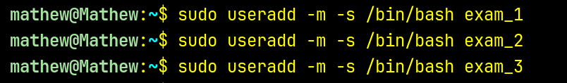

</details>
<br>

**2. Setting User Passwords**
Next, I assigned secure passwords to each of these newly created exam users using the `sudo passwd` command.

<details>
<summary> View Screenshot</summary>


</details>
<br>

**3. Initial Home Directory Security**
To ensure that regular users only have access to their own files, I initially restricted their home directory permissions to `700` using `chmod`, meaning only the owner can read, write, and execute.

<details>
<summary> View Screenshot</summary>

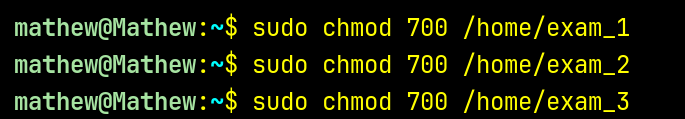

</details>
<br>

**4. Creating the Admin User**
I then created the `examadmin` user and established their account password.

<details>
<summary> View Screenshot</summary>

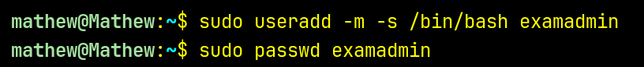

</details>
<br>

**5. Granting Root Privileges**
To give `examadmin` the necessary root privileges required by the instructions, I added the user to the system's `sudo` group using `sudo usermod -aG sudo examadmin`.

<details>
<summary> View Screenshot</summary>


</details>
<br>

**6. Creating the Audit User**
Following the requirements, I created the `examaudit` user account and assigned a password.

<details>
<summary> View Screenshot</summary>

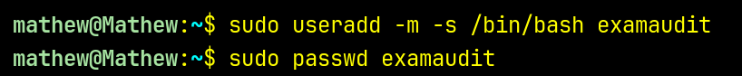

</details>
<br>

**7. Setting Up the Audit Group**
To fulfill the requirement of giving the audit user read-only access to all exam user home directories, I started by creating a dedicated group called `auditgroup`.

<details>
<summary> View Screenshot</summary>


</details>
<br>

**8. Adding Users to the Audit Group**
I added the `examaudit` user, along with `exam_1`, `exam_2`, and `exam_3`, into this new `auditgroup` using the `usermod -aG` command.

<details>
<summary> View Screenshot</summary>

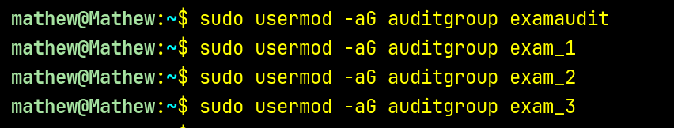

</details>
<br>

**9. Adjusting Permissions for Auditing**
I updated the permissions of the exam users' home directories to `750`. This keeps the owner at full access, gives the group read and execute access (so they can list files), and leaves others with absolute zero access.

<details>
<summary> View Screenshot</summary>

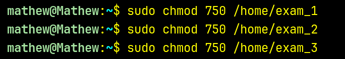

</details>
<br>

**10. Assigning Group Ownership**
Finally, I changed the group ownership of the exam home directories to `auditgroup` using the `chown` command. Because `examaudit` is a member of this group, this securely fulfills the read-only access requirement.

<details>
<summary> View Screenshot</summary>

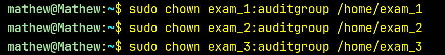

</details>
<br>

**11. Verifying Group Assignments**
To confirm all users were correctly assigned to their respective groups, I ran the `groups` command for each user. This output verified that `examadmin` is in the `sudo` group and the other users are in the `auditgroup`.

<details>
<summary> View Screenshot</summary>

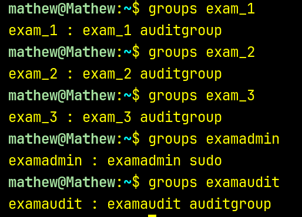

</details>
<br>

**12. Final Permission Audit**
I ran a long list command (`ls -ld`) on all the relevant home directories to double-check the final permissions and ownership setup. The output clearly shows the `750` permissions (drwxr-x---) and the `auditgroup` group ownership for the exam user directories.

<details>
<summary> View Screenshot</summary>

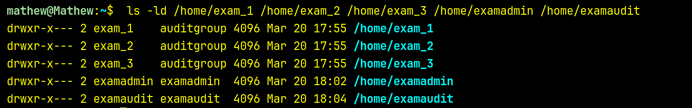

</details>
<br>

**13. Installing Disk Quota Tools**
Moving on to the quota requirements, I installed the necessary packages for managing disk usage by running `sudo apt install quota quotatool`.

<details>
<summary> View Screenshot</summary>


</details>
<br>

**14. Checking File System Type**
Before configuring quotas, I needed to confirm the root filesystem type (like ext4 or xfs) by checking the mount points using `mount | grep -E "ext4|ext3|xfs"`.

<details>
<summary> View Screenshot</summary>


</details>
<br>

**15. Preparing to Edit fstab**
To enable quotas permanently, I first viewed the `/etc/fstab` file using `cat` to locate the configuration line for the root partition (`/`).

<details>
<summary> View Screenshot</summary>


</details>
<br>

**16. Editing fstab**
I then opened `/etc/fstab` in the `micro` text editor to modify the mount options.

<details>
<summary> View Screenshot</summary>


</details>
<br>

**17. Adding the Quota Option**
Inside `fstab`, I appended `usrquota` to the options list for the root filesystem, telling the system to enforce user-level quotas on that partition.

<details>
<summary> View Screenshot</summary>

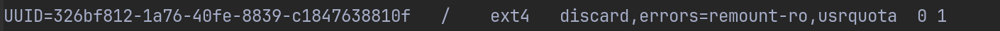

</details>
<br>

**18. Remounting the Filesystem**
To apply the changes made in `fstab` without needing a full system reboot, I remounted the root filesystem using `sudo mount -o remount /`.

<details>
<summary> View Screenshot</summary>


</details>
<br>

**19. Verifying the Quota Mount Option**
I ran a quick check against `/proc/mounts` to ensure that the `usrquota` option was actively applied to the root filesystem after the remount.

<details>
<summary> View Screenshot</summary>


</details>
<br>

**20. Initializing the Quota Database**
Finally, I ran `sudo quotacheck -cugm /` to create the initial quota database files (`aquota.user` and `aquota.group`) and scan the filesystem to calculate current disk usage.

<details>
<summary> View Screenshot</summary>


</details>
<br>

**21. Checking Existing Quotas**
To begin setting up disk space limits, I checked if any quota files already existed on the root filesystem by piping `ls -la /` into `grep aquota`.

<details>
<summary> View Screenshot</summary>


</details>
<br>

**22. Installing Quota Kernel Modules**
My initial attempt to turn on quotas failed because the kernel lacked the proper format support. To fix this, I installed the necessary extra Linux modules matching the current kernel version.

<details>
<summary> View Screenshot</summary>

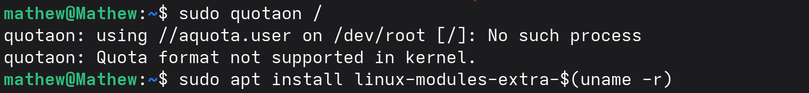

</details>
<br>

**23. Enabling the Quota System**
With the modules installed, I loaded the `quota_v2` module using `modprobe` and successfully activated the quota system on the root directory using `sudo quotaon /`.

<details>
<summary> View Screenshot</summary>

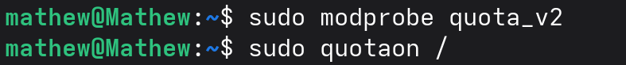

</details>
<br>

**24. Editing User Quotas**
To restrict the disk space for the exam users, I opened the quota editor specifically for `exam_1` using the `edquota` command.

<details>
<summary> View Screenshot</summary>


</details>
<br>

**25. Default Quota View**
Inside the editor, the default configuration showed that both the soft and hard block limits were set to `0`, meaning the user currently had unlimited disk space.

<details>
<summary> View Screenshot</summary>


</details>
<br>

**26. Enforcing Disk Limits**
I modified the configuration to impose strict disk limits, setting a soft limit of `1835008` blocks and a hard limit of `2097152` blocks to prevent the user from hoarding server space.

<details>
<summary> View Screenshot</summary>


</details>
<br>

**27. Verifying Applied Quotas**
After saving the file, I ran `sudo quota -u exam_1` to verify that the system properly registered the new storage restrictions for that specific user.

<details>
<summary> View Screenshot</summary>


</details>
<br>

**28. Cloning Quota Profiles**
Instead of manually editing the files for the other users, I used the `-p` flag with `edquota` to instantly copy the exact quota limits from `exam_1` over to `exam_2` and `exam_3`.

<details>
<summary> View Screenshot</summary>


</details>
<br>

**29. Admin and Audit Quotas**
I also configured disk quotas for the administrative accounts, setting up the primary limits for `examadmin` and cloning that profile over to `examaudit`.

<details>
<summary> View Screenshot</summary>


</details>
<br>

**30. Automated Secure Backup Script**
Finally, I wrote a bash script to handle backups of the exam user directories. The script contains a safeguard ensuring it can only be executed by `examadmin`. It loops through the target directories, compresses them using `tar`, and securely encrypts the output into a `.tar.gz.gpg` file using a passphrase hidden in a `.secret` file.

<details>
<summary> View Screenshot</summary>

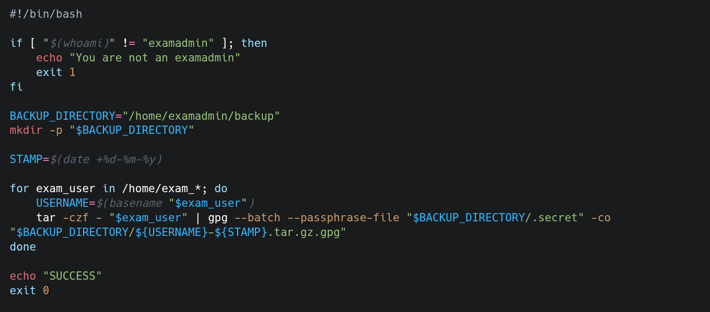

</details>
<br>
**31. Securing the Backup Script**
To ensure only the `examadmin` user can execute the newly created backup script, I changed its ownership to `examadmin` and restricted its permissions to `700` using `chmod`, verifying the changes with `ls -la`.

<details>
<summary> View Screenshot</summary>

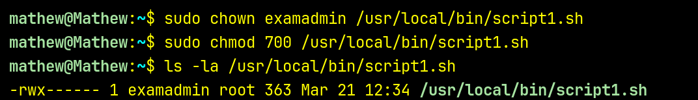

</details>
<br>

**32. Switching to Admin User**
With the script secured, I switched over to the `examadmin` user account using `su - examadmin` to set up the necessary backup directories and scheduling.

<details>
<summary> View Screenshot</summary>


</details>
<br>

**33. Creating the Backup Directory**
As the `examadmin` user, I created a dedicated `backup` directory in the home folder using `mkdir backup` to store the compressed and encrypted archives.

<details>
<summary> View Screenshot</summary>


</details>
<br>

**34. Creating the Passphrase File**
Inside the backup directory, I created a hidden file named `.secret` using the `touch` command. This file will hold the encryption passphrase required by the backup script.

<details>
<summary> View Screenshot</summary>

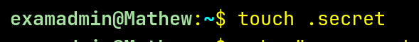

</details>
<br>

**35. Storing the Encryption Key**
I piped the actual passphrase into the hidden `.secret` file using the `echo` command so the script can access it during the encryption phase.

<details>
<summary> View Screenshot</summary>

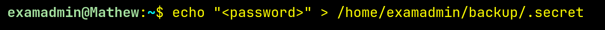

</details>
<br>

**36. Securing the Encryption Key**
Because this file contains a plain-text password, it is critical to secure it. I ran `chmod 600` on the `.secret` file so that absolutely no one except `examadmin` can read it.

<details>
<summary> View Screenshot</summary>


</details>
<br>

**37. Setting the Crontab Editor**
Before scheduling the script, I exported the `EDITOR` environment variable to use `micro`, making it easier to edit the cron jobs.

<details>
<summary> View Screenshot</summary>


</details>
<br>

**38. Opening the Crontab**
I opened the user's crontab file for editing by executing `crontab -e`.

<details>
<summary> View Screenshot</summary>


</details>
<br>

**39. Scheduling the Daily Backup**
Inside the crontab, I added the line `0 2 * * * /usr/local/bin/script1.sh` to fulfill the requirement of running the backup script daily. This specific cron expression schedules the execution for exactly 2:00 AM every single day.

<details>
<summary> View Screenshot</summary>


</details>
<br>

**40. Verifying the Scheduled Job**
Finally, I saved the file and ran `crontab -l` to list the active cron jobs and verify that the daily backup schedule was successfully registered for the `examadmin` user.

<details>
<summary> View Screenshot</summary>


</details>
<br>

<br>

## 5. Web Server Deployment and Secure Configuration

**1. Creating a Non-Privileged User**
As instructed, the web applications must run from a non-privileged user. I started by creating a dedicated user named `task5` using `sudo useradd` and assigned it a password.

<details>
<summary> View Screenshot</summary>

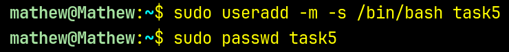

</details>
<br>

**2. Switching to the App User**
I then switched over to the newly created non-privileged account using `su - task5` to perform the rest of the application setup.

<details>
<summary> View Screenshot</summary>


</details>
<br>

**3. Securing the Home Directory**
To secure the application environment, I restricted the `task5` home directory permissions to `700`, ensuring only this specific user has read, write, and execute access.

<details>
<summary> View Screenshot</summary>


</details>
<br>

**4. Creating the Apps Directory**
I created a parent directory named `apps` inside the home folder to store all the application binaries and configurations.

<details>
<summary> View Screenshot</summary>


</details>
<br>

**5. Setting Up App Folders**
I navigated into the `apps` directory and created separate subdirectories for `app1` and `app2` to keep the application files cleanly organized.

<details>
<summary> View Screenshot</summary>

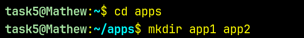

</details>
<br>

**6. Downloading App1 and Signature**
Inside the `app1` folder, I used `wget` to download the `app1` executable and its corresponding SHA256 signature file directly from the provided URLs.

<details>
<summary> View Screenshot</summary>

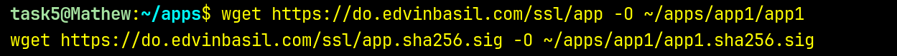

</details>
<br>

**7. Preparing the Official Signature**
To verify the file's integrity, I copied the contents of the official downloaded signature file into a temporary text file named `t1.txt`.

<details>
<summary> View Screenshot</summary>


</details>
<br>

**8. Hashing the Downloaded App**
Next, I generated the SHA256 hash of the downloaded `app1` binary, used `awk` to isolate just the hash string, and piped it into a second text file named `t2.txt`.

<details>
<summary> View Screenshot</summary>

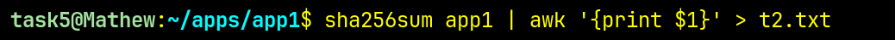

</details>
<br>

**9. Verifying the Signature Match**
I used the `diff` command to compare `t1.txt` and `t2.txt`. Since the command returned no output, it confirmed that both hashes matched perfectly, verifying the file's authenticity.

<details>
<summary> View Screenshot</summary>

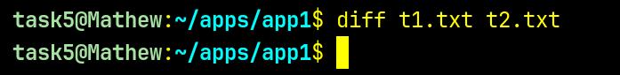

</details>
<br>

**10. Making the App Executable**
Finally, with the file safely verified, I modified its permissions to make the `app1` binary executable by running `chmod +x app1`.

<details>
<summary> View Screenshot</summary>

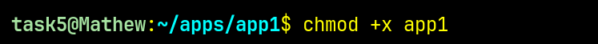

</details>
<br>

**11. Cleaning Up Temporary Files**
After confirming the integrity of the binary, I removed the temporary files `t1.txt` and `t2.txt` that were used during the signature verification process.

<details>
<summary> View Screenshot</summary>


</details>
<br>

**12. Cloning App2 from Repository**
I cloned the `issslopen` application from its GitLab repository directly into the `~/apps/app2` directory using `git clone`.

<details>
<summary> View Screenshot</summary>


</details>
<br>

**13. Installing Dependencies for App2**

After cloning the repository, I navigated into the `app2` directory and installed all required dependencies using `npm install`.

This command reads the `package.json` file and downloads all necessary packages needed to run the application.

<details>
<summary> View Screenshot</summary>


</details>
<br>

**14. Installing Required Utility (unzip)**

To ensure support for extracting compressed files (if required by the application setup), I installed the `unzip` utility using the package manager.

<details>
<summary> View Screenshot</summary>

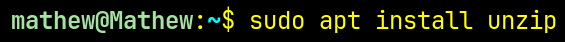

</details>
<br>

**15. Installing Bun Runtime**
I installed the Bun JavaScript runtime using the official install script via `curl`, then sourced `~/.bashrc` to make the `bun` command available in the current shell session.

<details>
<summary> View Screenshot</summary>

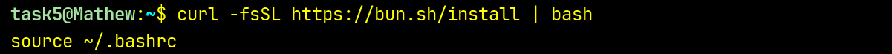

</details>
<br>

**16. Installing and Starting Nginx**
I installed Nginx using `apt`, then started the service and enabled it to launch automatically on system boot, all in a single chained command.

<details>
<summary> View Screenshot</summary>


</details>
<br>

**17. Verifying Nginx Status**
I confirmed that the Nginx service was running correctly by checking its status with `systemctl status nginx`.

<details>
<summary> View Screenshot</summary>


</details>
<br>

**18. Starting App1 in the Background**
I launched the `app1` binary as a background process using `nohup`, redirecting both stdout and stderr to a log file at `~/apps/app1/app1.log` so it persists after the session ends.

<details>
<summary> View Screenshot</summary>


</details>
<br>

**19. Starting App2 in the Background**
I navigated into the `app2` directory and started the application using `nohup npm start`, redirecting output to `app2.log`, then returned to the home directory.

<details>
<summary> View Screenshot</summary>

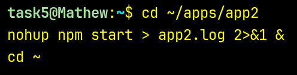

</details>
<br>

**20. Confirming All Services Are Listening**
I used `ss -tulnp` filtered for ports `80`, `3000`, and `8008` to verify that Nginx was listening on port 80, `app2` (via Bun) on port 3000, and `app1` on port 8008 — confirming all three services were running as expected.

<details>
<summary> View Screenshot</summary>

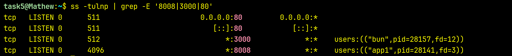

</details>
<br>

**21. Installing Certbot and Attempting Let's Encrypt SSL**
I installed Certbot along with the Nginx plugin and attempted to obtain a Let's Encrypt certificate for the domain. However, due to the college's upstream server intercepting port 80, automated certificate issuance was not possible.

<details>
<summary> View Screenshot</summary>

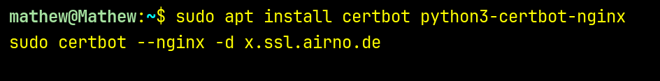

</details>
<br>

**22. Creating the Nginx Reverse Proxy Config**
I opened a new Nginx site configuration file named `ssl-proxy` using the `micro` editor to define the reverse proxy rules for the domain.

<details>
<summary> View Screenshot</summary>


</details>
<br>

**23. Writing the Nginx Configuration**
The configuration sets up an HTTP-to-HTTPS redirect on port 80, and a TLS-enabled server block on port 443 using the self-signed certificate. It includes security headers (`Content-Security-Policy`, `X-Content-Type-Options`, `X-Frame-Options`) and defines location blocks to proxy `/server1/` and `/app1/` to `app1` on port 8008, `/sslopen` to `app2` on port 3000, and the root `/` to port 8080.

<details>
<summary> View Screenshot</summary>

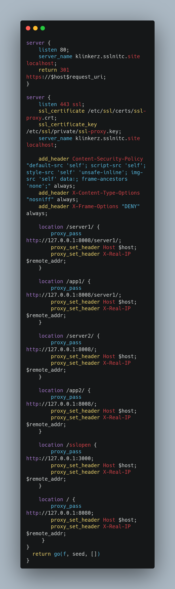

</details>
<br>

**24. Enabling the Site**
I created a symlink from the `sites-available` config into `sites-enabled` to activate the new Nginx virtual host.

<details>
<summary> View Screenshot</summary>


</details>
<br>

**25. Testing and Reloading Nginx**
I ran `nginx -t` to validate the configuration syntax, then reloaded Nginx to apply the changes without downtime.

<details>
<summary> View Screenshot</summary>

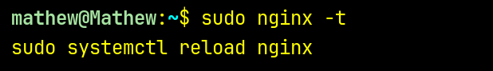

</details>
<br>

**26. Removing the Default Site and Testing**
I removed the default Nginx site from `sites-enabled` to avoid conflicts, reloaded Nginx, and verified the proxy was working correctly by curling `http://localhost/server1/`.

<details>
<summary> View Screenshot</summary>

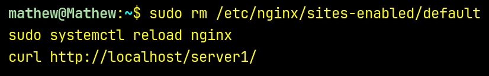

</details>
<br>

**27. Generating a Self-Signed SSL Certificate**
Since Let's Encrypt was unavailable due to port 80 being intercepted by the college's upstream server, I generated a self-signed RSA 2048-bit certificate valid for 365 days using `openssl`, storing the key at `/etc/ssl/private/ssl-proxy.key` and the certificate at `/etc/ssl/certs/ssl-proxy.crt` with the CN set to the domain.

<details>
<summary> View Screenshot</summary>

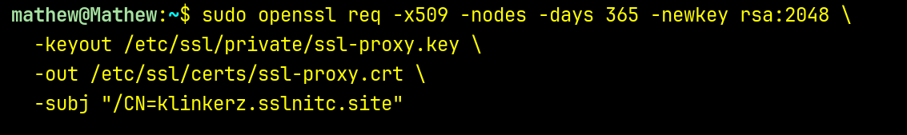

</details>
<br>

**28. Reloading Nginx and Testing HTTPS Endpoints**
After reloading the validated Nginx config, I tested all four proxy routes over HTTPS using `curl -k` (to bypass the self-signed certificate warning), confirming that `/server1/`, `/app1/`, `/server2/`, and `/app2/` all resolved correctly through the reverse proxy.

<details>
<summary> View Screenshot</summary>

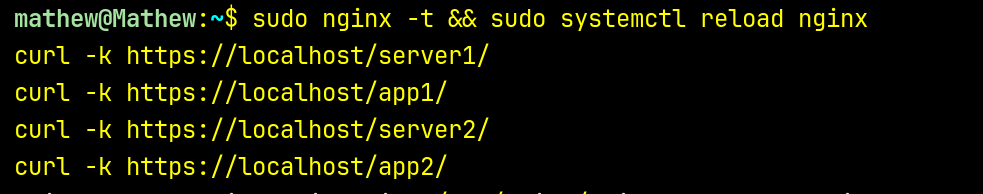

</details>
<br>

**29. Blocking Direct App Port Access via UFW**
To prevent clients from bypassing the reverse proxy and accessing the apps directly, I added UFW deny rules for ports `8008` (app1) and `3000` (app2).

<details>
<summary> View Screenshot</summary>

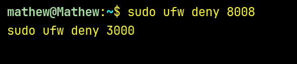

</details>
<br>

**30. Retrying Let's Encrypt Certificate**
I made another attempt to obtain a proper Let's Encrypt TLS certificate for `klinkerz.sslnitc.site` using Certbot's Nginx plugin, though this remained blocked by the college's upstream server intercepting port 80.

<details>
<summary> View Screenshot</summary>


</details>
<br>

**31. Configuring Azure NSG Inbound Rules**
In the Azure portal, I configured the Network Security Group (`Mathew-nsg`) to allow inbound traffic on port 80 (HTTP) and port 443 (HTTPS), alongside the existing SSH rules, while keeping all other inbound traffic denied by default.

<details>
<summary> View Screenshot</summary>

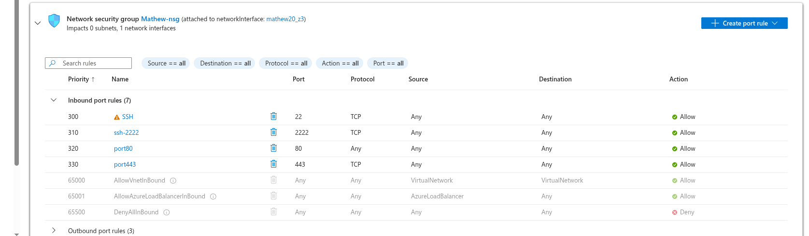

</details>
<br>

**32. Copying the Environment File**
Inside the `app2` directory, I copied `.env.local` to `.env` to set up the required environment configuration for the application.

<details>
<summary> View Screenshot</summary>


</details>
<br>

**33. Killing the Existing App2 Process**
I terminated the previously running `app2` instance by killing the process listening on port 3000, using `lsof` to identify its PID.

<details>
<summary> View Screenshot</summary>


</details>
<br>

**34. Restarting App2 with Bun**
I relaunched `app2` using `nohup bun index.ts`, redirecting output to `app2.log`, to run it correctly under the Bun runtime with the updated environment configuration.

<details>
<summary> View Screenshot</summary>

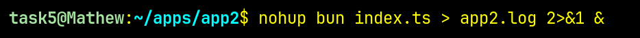

</details>
<br>

<br>

## 6. Database Security

**1. Updating Package Lists**
I started by refreshing the package lists to ensure the latest versions of all packages would be available for installation.

<details>
<summary> View Screenshot</summary>


</details>
<br>

**2. Installing MariaDB**
I installed the MariaDB server package using `apt`.

<details>
<summary> View Screenshot</summary>


</details>
<br>

**3. Accessing the MariaDB Shell**
I entered the MariaDB shell as root using `sudo mariadb` to begin the database setup.

<details>
<summary> View Screenshot</summary>


</details>
<br>

**4. Creating the Database**
Inside the MariaDB shell, I created the required database named `secure_onboarding`.

<details>
<summary> View Screenshot</summary>


</details>
<br>

**5. Creating the SQL Script File**
I created a `task6` working directory, navigated into it, and opened a new SQL script file named `min-privileges-user.sql` using the `micro` editor.

<details>
<summary> View Screenshot</summary>

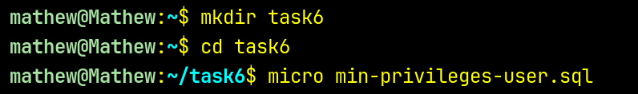

</details>
<br>

**6. Writing the Minimal Privilege User Script**
The script creates a user `onboarding_user` restricted to `localhost`, grants it only the necessary `SELECT`, `INSERT`, `UPDATE`, and `DELETE` privileges on the `secure_onboarding` database, and flushes privileges to apply the changes.

<details>
<summary> View Screenshot</summary>

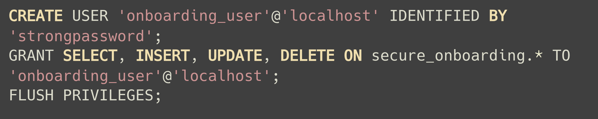

</details>
<br>

**7. Executing the SQL Script**
I sourced the SQL script from within the MariaDB shell to create the minimal-privilege user and apply all the grants.

<details>
<summary> View Screenshot</summary>


</details>
<br>

**8. Enabling MariaDB on Boot**
I enabled and started the MariaDB service using `systemctl enable --now` to ensure it runs automatically on system startup.

<details>
<summary> View Screenshot</summary>


</details>
<br>

**9. Running the Secure Installation Script**
I ran `mysql_secure_installation` to harden the MariaDB setup — removing anonymous users, disabling remote root login, and dropping the test database.

<details>
<summary> View Screenshot</summary>


</details>
<br>

**10. Verifying Root is Localhost-Only**
I logged into MariaDB as root and queried `mysql.user` to confirm that the `root` account is bound exclusively to `localhost`, ensuring no remote root access is possible.

<details>
<summary> View Screenshot</summary>

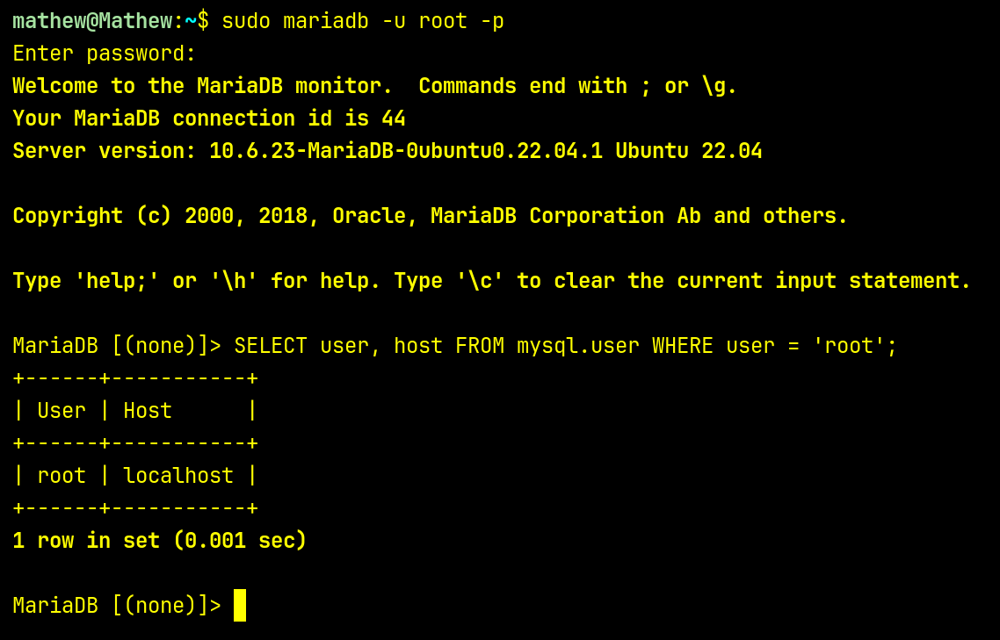

</details>
<br>
**11. Editing the MariaDB Server Config**
I opened `/etc/mysql/mariadb.conf.d/50-server.cnf` to configure the bind address and restrict database access to localhost only.

<details>
<summary> View Screenshot</summary>


</details>
<br>

**12. Binding MariaDB to Localhost Only**
I set `bind-address = 127.0.0.1` under the `[mysqld]` section, ensuring MariaDB rejects any connections from external or LAN interfaces.

<details>
<summary> View Screenshot</summary>

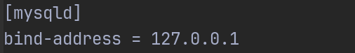

</details>
<br>

**13. Restarting MariaDB**
I restarted the MariaDB service to apply the updated bind-address configuration.

<details>
<summary> View Screenshot</summary>


</details>
<br>

**14. Verifying Localhost-Only Binding**
I used `ss -tlnp | grep 3306` to confirm that MariaDB was now listening exclusively on `127.0.0.1:3306`, with no external interfaces exposed.

<details>
<summary> View Screenshot</summary>

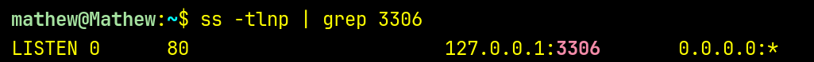

</details>
<br>

**15. Creating the Backup Credentials File**
I created `/etc/mysql/backup.cnf` to securely store the MariaDB credentials used by the automated backup script, keeping them out of the script itself.

<details>
<summary> View Screenshot</summary>


</details>
<br>

**16. Creating the Backup Script**
I created the backup script at `/usr/local/bin/backup_secure_onboarding.sh` using `sudo micro`.

<details>
<summary> View Screenshot</summary>


</details>
<br>

**17. Writing the Backup Script**
The script sets a backup directory at `~/mariadbbackup`, generates a timestamped filename, and uses `mysqldump` with the credentials file to dump the `secure_onboarding` database. It also prunes backups older than 7 days automatically.

<details>
<summary> View Screenshot</summary>

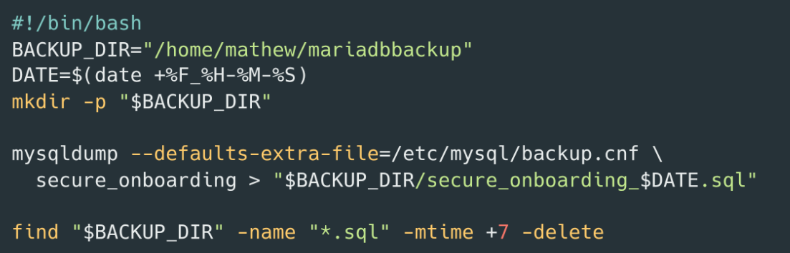

</details>
<br>

**18. Making the Script Executable**
I granted execute permissions to the backup script using `chmod +x`.

<details>
<summary> View Screenshot</summary>


</details>
<br>

**19. Opening the Crontab**
I opened the crontab editor with `crontab -e` to schedule the backup script for automatic daily execution.

<details>
<summary> View Screenshot</summary>


</details>
<br>

**20. Scheduling the Daily Backup**
I added a cron entry to run the backup script every day at 2:00 AM, ensuring regular automated backups of the `secure_onboarding` database.

<details>
<summary> View Screenshot</summary>


</details>
<br>

**21. Fixing Backup Directory Ownership**
The backup script failed with a permission error because the `mariadbbackup` directory was owned by root. I fixed this by transferring ownership to the `mathew` user so the cron job can write backups without requiring elevated privileges.

<details>
<summary> View Screenshot</summary>


</details>
<br>

<br>

## 7. VPN Configuration

**1. Installing WireGuard**
I updated the package lists and installed WireGuard in a single chained command.

<details>
<summary> View Screenshot</summary>


</details>
<br>

**2. Switching to Root**
I escalated to a root shell using `sudo -i` to perform the WireGuard key generation and configuration steps with the required privileges.

<details>
<summary> View Screenshot</summary>


</details>
<br>

**3. Navigating to the WireGuard Directory**
I moved into `/etc/wireguard` where all server keys and configuration files would be stored.

<details>
<summary> View Screenshot</summary>

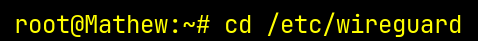

</details>
<br>

**4. Setting Restrictive File Permissions**
I set `umask 077` so that any files created in this directory would be readable and writable only by root, preventing accidental exposure of private keys.

<details>
<summary> View Screenshot</summary>


</details>
<br>

**5. Generating the Server Key Pair**
I generated the server's private key, saved it to `privatekey`, and derived the corresponding public key into `publickey` in a single pipeline using `wg genkey`, `tee`, and `wg pubkey`.

<details>
<summary> View Screenshot</summary>


</details>
<br>

**6. Editing sysctl Configuration**
I opened `/etc/sysctl.conf` to enable IPv4 packet forwarding, which is required for the VPN server to route traffic between peers and the internet.

<details>
<summary> View Screenshot</summary>


</details>
<br>

**7. Enabling IPv4 Forwarding**
I uncommented the `net.ipv4.ip_forward=1` line to allow the kernel to forward packets between network interfaces.

<details>
<summary> View Screenshot</summary>

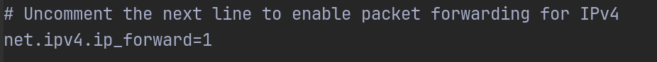

</details>
<br>

**8. Applying the sysctl Changes**
I ran `sudo sysctl -p` to reload the sysctl configuration and activate IP forwarding immediately without requiring a reboot.

<details>
<summary> View Screenshot</summary>


</details>
<br>

**9. Creating the WireGuard Interface Config**
I created and edited the WireGuard server configuration file `wg0.conf` using `sudo micro`, defining the server interface, private key, listen port, and peer entries.

<details>
<summary> View Screenshot</summary>


</details>
<br>

**10. Securing the Config and Starting WireGuard**
I restricted `wg0.conf` to root-only access with `chmod 600`, then enabled and started the WireGuard interface using `wg-quick@wg0`, and confirmed it was running with `wg show`.

<details>
<summary> View Screenshot</summary>

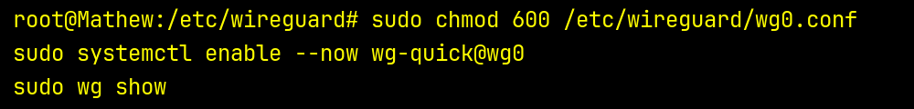

</details>
<br>

**11. Generating Peer Key Pairs**
I generated separate private and public key pairs for both VPN users (`user1` and `user2`), storing each in dedicated key files within `/etc/wireguard`.

<details>
<summary> View Screenshot</summary>

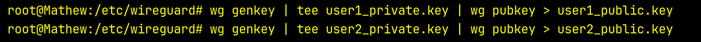

</details>
<br>

**12. Opening the WireGuard UDP Port**
I added a UFW rule to allow inbound traffic on UDP port `51820` (the WireGuard listen port) and reloaded UFW to apply the change.

<details>
<summary> View Screenshot</summary>

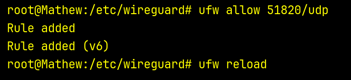

</details>
<br>

**13. Restarting the WireGuard Interface**
I restarted the `wg-quick@wg0` service to apply the updated server configuration including the newly added peer entries.

<details>
<summary> View Screenshot</summary>


</details>
<br>

**14. Final wg0.conf Configuration**
The server config sets the VPN interface at `10.0.0.1/24` on port `51820`, with `PostUp`/`PostDown` iptables rules to enable NAT masquerading through `eth0` for internet access. Two peer blocks are defined — `user1` at `10.0.0.2/32` and `user2` at `10.0.0.3/32` — each identified by their respective public keys.

<details>
<summary> View Screenshot</summary>

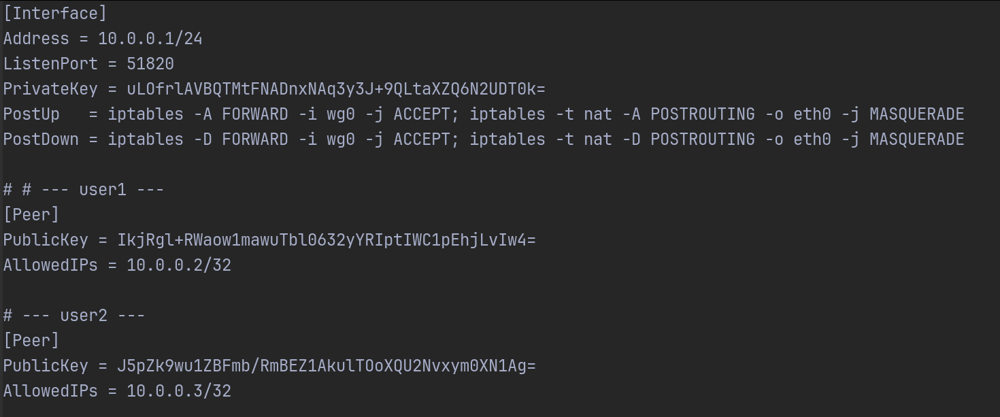

</details>
<br>

**15. Installing resolvconf and Bringing Up User1**
I installed `resolvconf` (required for DNS resolution in WireGuard tunnels) and brought up the `user1` client configuration using `wg-quick up user1`.

<details>
<summary> View Screenshot</summary>


</details>
<br>

**16. Verifying Active WireGuard Peers**
I ran `wg show` to confirm the WireGuard server was running with both peers registered and the interface active.

<details>
<summary> View Screenshot</summary>

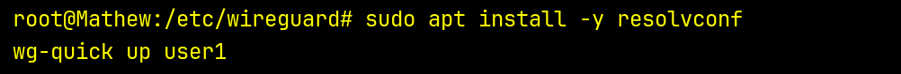

</details>
<br>

WireGuard uses asymmetric key pairs for authentication — each party generates a private key and derives a public key from it. The private key never leaves the machine it was generated on. The server's `wg0.conf` holds the **server's own private key** and each **peer's public key**. Each client config holds the **client's own private key** and the **server's public key**. When a handshake is initiated, WireGuard uses this cross-knowledge to mutually authenticate both ends — no passwords, no certificates. If the keys don't match, the connection is silently dropped.

<br>

## 8. Docker Fundamentals and Personal Website Deployment

**1. Scaffolding the Portfolio with Vue**
I initialized the portfolio project using `npm create vue@latest` to scaffold a modern Vue.js application as the base for the personal website.

<details>
<summary> View Screenshot</summary>


</details>
<br>

**2. Setting Up Docker's Official APT Repository**
I installed the required dependencies, created the keyrings directory, downloaded Docker's official GPG key from Docker's CDN, and made it readable system-wide in preparation for adding the official Docker apt source.

<details>
<summary> View Screenshot</summary>

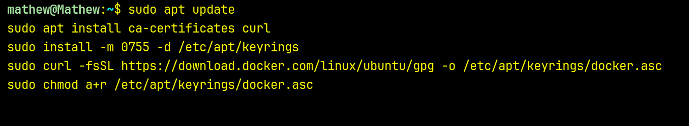

</details>
<br>

**3. Adding the Docker APT Source**
I wrote the Docker repository configuration into `/etc/apt/sources.list.d/docker.sources` using a heredoc, targeting the correct Ubuntu codename and architecture, then refreshed the package lists.

<details>
<summary> View Screenshot</summary>

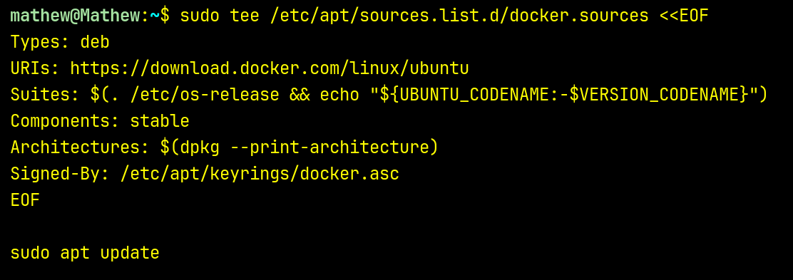

</details>
<br>

**4. Installing Docker Engine**
I installed the full Docker stack — `docker-ce`, `docker-ce-cli`, `containerd.io`, and the Buildx and Compose plugins — from the official Docker repository.

<details>
<summary> View Screenshot</summary>


</details>
<br>

**5. Verifying Docker is Running**
I confirmed that the Docker service was active and running correctly using `systemctl status docker`.

<details>
<summary> View Screenshot</summary>


</details>
<br>

**6. Adding User to the Docker Group**
I added the current user to the `docker` group using `usermod -aG docker $USER` to enable running Docker commands without requiring `sudo`.

<details>
<summary> View Screenshot</summary>


</details>
<br>

**7. Logging Out to Apply Group Membership**
I logged out of the session so the new `docker` group membership would take effect on the next login.

<details>
<summary> View Screenshot</summary>


</details>
<br>

**8. Testing Docker with Hello World**
After logging back in, I verified the Docker installation was working correctly by running the `hello-world` container.

<details>
<summary> View Screenshot</summary>


</details>
<br>

**9. Cloning the Portfolio Repository**
I cloned the portfolio website source code from GitHub into the home directory to prepare it for containerization.

<details>
<summary> View Screenshot</summary>


</details>
<br>

**10. Installing NVM**
I installed Node Version Manager (NVM) using the official install script to manage the Node.js version required to build the Vue portfolio app.

<details>
<summary> View Screenshot</summary>


</details>
<br>

**11. Sourcing bashrc**
I sourced `~/.bashrc` to load the NVM environment variables into the current shell session after installation.

<details>
<summary> View Screenshot</summary>


</details>
<br>

**12. Installing and Activating Node 20**
I installed Node.js version 20 via NVM and switched to it as the active version.

<details>
<summary> View Screenshot</summary>


</details>
<br>

**13. Installing Project Dependencies**
I navigated into the `Portfolio` directory and ran `npm i` to install all required dependencies.

<details>
<summary> View Screenshot</summary>


</details>
<br>

**14. Creating the Dockerfile**
I created a `Dockerfile` in the Portfolio directory using `micro` to define the container build instructions.

<details>
<summary> View Screenshot</summary>


</details>
<br>

**15. Writing the Dockerfile**
The Dockerfile uses a multi-stage build — the first stage uses `node:20-alpine` to install dependencies and build the Vue app, and the second stage copies the compiled `dist/` output into an `nginx:alpine` image, exposing port 80 and running Nginx in the foreground.

<details>
<summary> View Screenshot</summary>


</details>
<br>

**16. Building the Docker Image**
I built the Docker image and tagged it as `portfolio-vue` from the current directory.

<details>
<summary> View Screenshot</summary>


</details>
<br>

**17. Running the Portfolio Container**
I launched the container as a detached daemon bound to `127.0.0.1:8080`, mounted `/opt/portfolio` as a read-only volume, added the `NET_ADMIN` capability, and set it to restart automatically unless explicitly stopped.

<details>
<summary> View Screenshot</summary>


</details>
<br>

**18. Creating the Nginx Reverse Proxy Config**
I created a new Nginx site configuration file named `portfolio` to proxy traffic from port 80 to the container.

<details>
<summary> View Screenshot</summary>


</details>
<br>

**19. Writing the Portfolio Nginx Config**
I wrote a dedicated Nginx config for the portfolio site that proxies requests on port 80 to the container at `127.0.0.1:8080`. I also added the same location block inside the existing `ssl-proxy` config from Task 5, so the portfolio is accessible over both HTTP and HTTPS.

<details>
<summary> View Screenshot</summary>


</details>
<br>

**20. Enabling the Portfolio Site**
I created a symlink from `sites-available/portfolio` into `sites-enabled` to activate the Nginx reverse proxy for the portfolio.

<details>
<summary> View Screenshot</summary>


</details>
<br>

**21. Adding the Portfolio Block to ssl-proxy**
I opened the `ssl-proxy` config directly from `sites-enabled` and added the portfolio location block to also serve it over HTTPS alongside the other proxied apps.

<details>
<summary> View Screenshot</summary>


</details>
<br>

**22. The Portfolio Location Block**
The added `location /` block proxies all root requests to the portfolio container at `127.0.0.1:8080`, forwarding the `Host` and `X-Real-IP` headers.

<details>
<summary> View Screenshot</summary>


</details>
<br>

**23. Validating and Reloading Nginx**
I tested the updated Nginx configuration with `nginx -t` and reloaded the service to apply all changes.

<details>
<summary> View Screenshot</summary>


</details>
<br>

**24. Building and Deploying the Portfolio**
I ran `npm run build` to produce the production `dist/` output, then copied the built files into `/opt/portfolio/` — the volume mounted into the running container.

<details>
<summary> View Screenshot</summary>


</details>
<br>

**25. Setting Ownership and Verifying**
I set ownership of `/opt/portfolio` to UID/GID `101:101` (the Nginx user inside the container) so it can read the mounted

<br>

## 9. Ansible Automation in Dockerized Lab Environment

**1. Creating a Docker Network**
I created a dedicated Docker bridge network called `ansible-net` to allow isolated communication between the Ansible control node and target containers.

<details>
<summary> View Screenshot</summary>


</details>
<br>

**2. Setting Up the Task Directory and Target Dockerfile**
I created a `task9` directory, navigated into it, and opened `target.Dockerfile` in the micro editor to define the target node image.

<details>
<summary> View Screenshot</summary>


</details>
<br>

**3. Writing the Target Dockerfile**
I wrote the target node Dockerfile based on `ubuntu:22.04`, installing `openssh-server` and `sudo`, creating the `/var/run/sshd` directory, adding an `ansible` user with password `ansible`, granting it sudo access, exposing port 22, and setting `sshd` as the default command.

<details>
<summary> View Screenshot</summary>


</details>
<br>

**4. Opening the Control Dockerfile**
I opened `control.Dockerfile` in the micro editor to define the Ansible control node image.

<details>
<summary> View Screenshot</summary>


</details>
<br>

**5. Writing the Control Dockerfile**
I wrote the control node Dockerfile based on `ubuntu:22.04`, installing `ansible` and `openssh-client`, creating an `ansible` user, and setting `bash` as the default command.

<details>
<summary> View Screenshot</summary>


</details>
<br>

**6. Building Both Images**
I built both Docker images — `ansible-target` from `target.Dockerfile` and `ansible-control` from `control.Dockerfile` — in a single chained command.

<details>
<summary> View Screenshot</summary>


</details>
<br>

**7. Running the Containers**
I launched two target containers (`target1`, `target2`) and one control container (`control`) in detached mode, all attached to the `ansible-net` network.

<details>
<summary> View Screenshot</summary>


</details>
<br>

**8. Exec-ing into the Control Container**
I opened an interactive bash shell inside the `control` container using `docker exec`.

<details>
<summary> View Screenshot</summary>


</details>
<br>

**9. Switching to the Ansible User**
Inside the control container, I switched to the `ansible` user using `su - ansible` to operate under the correct identity for SSH key setup.

<details>
<summary> View Screenshot</summary>


</details>
<br>

**10. Generating an SSH Key Pair**
I generated an RSA SSH key pair with no passphrase, saving it to `~/.ssh/id_rsa`, to enable passwordless SSH access from the control node to the target nodes.

<details>
<summary> View Screenshot</summary>


</details>
<br>

**11. Copying SSH Keys to Target Nodes**
I copied the control node's public SSH key to both `target1` and `target2` using `ssh-copy-id`, authenticating with the `ansible` password to enable passwordless SSH access.

<details>
<summary> View Screenshot</summary>


</details>
<br>

**12. Creating the Ansible Inventory**
I wrote an inventory file at `~/inventory` using a heredoc, defining a `[targets]` group containing `target1` and `target2`.

<details>
<summary> View Screenshot</summary>


</details>
<br>

**13. Writing the First Playbook (pb1.yml)**
I created `pb1.yml` targeting the `[targets]` group with three tasks: a ping check, a disk space report using `df -h` with the output registered and debugged, and an uptime check similarly registered and debugged.

<details>
<summary> View Screenshot</summary>


</details>
<br>

**14. Running the First Playbook**
I executed `pb1.yml` against the inventory to verify connectivity and gather disk and uptime information from both target nodes.

<details>
<summary> View Screenshot</summary>


</details>
<br>

**15. Installing Micro and Opening pb2.yml**
I installed the `micro` editor via `sudo apt install` and immediately opened `pb2.yml` for editing.

<details>
<summary> View Screenshot</summary>


</details>
<br>

**16. Writing the Second Playbook (pb2.yml)**
I wrote a comprehensive lab configuration management playbook targeting the `[targets]` group with `become: yes`. It defines variables for packages, bash aliases, vim settings, and SSH hardening parameters, then runs tasks covering system updates, package installation with conditional lab-only extras, bash and vim configuration, SSH hardening via `lineinfile`, file permission hardening, a secure temp workspace, and final verification of all installed packages.

<details>
<summary> View Screenshot</summary>


</details>
<br>

**17. Running the Second Playbook**
I ran `pb2.yml` with `--forks=1` for sequential execution and `--ask-become-pass` to supply the sudo password for privilege escalation on the target nodes.

<details>
<summary> View Screenshot</summary>


</details>
<br>

**18. Creating Ansible Role Directory Structure**
I created the standard role directory layout for two roles — `lab-base` and `student-workstation` — each with `tasks`, `handlers`, `defaults`, `vars`, and `templates` subdirectories.

<details>
<summary> View Screenshot</summary>


</details>
<br>

**19. Writing the lab-base Role Defaults**
I wrote `roles/lab-base/defaults/main.yml` with default variables: timezone set to `Asia/Kolkata`, `lab_hostname` set to `lab-target`, and `monitoring_tools` listing `netdata`.

<details>
<summary> View Screenshot</summary>


</details>
<br>

**20. Writing the lab-base Role Tasks**
I wrote `roles/lab-base/tasks/main.yml` with five tasks: updating and upgrading packages, installing `tzdata`, symlinking the timezone to `/etc/localtime`, writing the hostname from the `lab_hostname` variable to `/etc/hostname`, and installing the packages listed in `monitoring_tools`.

<details>
<summary> View Screenshot</summary>


</details>
<br>

**21. Writing the lab-base Role Handler**
I wrote `roles/lab-base/handlers/main.yml` with a single handler to restart the `cron` service using `ansible.builtin.service`.

<details>
<summary> View Screenshot</summary>


</details>
<br>

**22. Writing the student-workstation Role Defaults**
I wrote `roles/student-workstation/defaults/main.yml` defining `student_user` as `student`, `student_password` as `student@ansible`, and a `dev_tools` list containing `gcc`, `python3`, `python3-pip`, `nodejs`, and `npm`.

<details>
<summary> View Screenshot</summary>


</details>
<br>

**23. Writing the student-workstation Role Vars**
I wrote `roles/student-workstation/vars/main.yml` setting the `shell` variable to `/bin/bash`.

<details>
<summary> View Screenshot</summary>


</details>
<br>

**24. Writing the bashrc Jinja2 Template**
I wrote `roles/student-workstation/templates/bashrc.j2` defining a custom PS1 prompt, `ll` and `gs` aliases, and a PATH export that includes the student user's `.local/bin` directory using the `student_user` variable.

<details>
<summary> View Screenshot</summary>


</details>
<br>

**25. Writing the student-workstation Role Tasks**
I wrote `roles/student-workstation/tasks/main.yml` with three tasks: creating the student user account with a SHA-512 hashed password, installing the `dev_tools` packages, and deploying the `bashrc.j2` template to the student's home directory with `0644` permissions.

<details>
<summary> View Screenshot</summary>


</details>
<br>

**26. Writing the Third Playbook (pb3.yml)**
I wrote `pb3.yml` as a single play targeting `[targets]` with `become: yes`, applying both the `lab-base` and `student-workstation` roles.

<details>
<summary> View Screenshot</summary>


</details>
<br>

**27. Recreating Target Containers with Privileged Mode**
I stopped and removed the original target containers, then relaunched them with `--privileged` and an explicit `/usr/sbin/sshd -D` entrypoint to allow `sshd` and service management to function correctly.

<details>
<summary> View Screenshot</summary>


</details>
<br>

**28. Deploying SSH Authorized Keys to Target Containers**
From the host, I created `/root/.ssh` on both targets, copied the ansible user's public key from `/tmp/ansible.pub` into each container's `authorized_keys`, and set permissions to `600`.

<details>
<summary> View Screenshot</summary>


</details>
<br>

**29. Updating the Inventory to Use Root**
I updated `~/inventory` to set `ansible_user=root` for both `target1` and `target2`, matching the key-based auth configured on the containers.

<details>
<summary> View Screenshot</summary>


</details>
<br>

**30. Enabling Root Login and Pubkey Auth on Targets**
I appended `PermitRootLogin yes` and `PubkeyAuthentication yes` to `/etc/ssh/sshd_config` on both target containers via `docker exec`, then restarted both containers to apply the SSH configuration changes.

<details>
<summary> View Screenshot</summary>


</details>
<br>

**31. Fixing Ownership of Authorized Keys**
I set the owner and group of `/root/.ssh/authorized_keys` to `root:root` on both target containers to satisfy SSH's strict permission requirements.

<details>
<summary> View Screenshot</summary>


</details>
<br>

**32. Running pb3.yml Twice to Verify Idempotency**
I ran `pb3.yml` against the inventory twice in succession using `--ask-become-pass`. Running the playbook a second time with no changes to the system confirms idempotency — all tasks should report `ok` rather than `changed` on the second run.

<details>
<summary> View Screenshot</summary>


</details>
<br>
<br>

# SSH Port Change Lab — Azure VM

## Overview

This lab documents the process of changing the default SSH port on an Azure Ubuntu VM (`Mathew`) from port **22** to port **2222**, and blocking access on the old port.

---

## Steps Performed

### 1. Edit SSH Daemon Config

```bash
sudo micro /etc/ssh/sshd_config
```

Changed the `Port` directive from `22` to `2222`.

### 2. Restart SSH Service

```bash
sudo systemctl restart ssh
```

Applied the new port configuration.

### 3. Add Inbound NSG Rule (Azure Portal)

In **Networking → Network settings → Mathew-nsg**, added a new inbound security rule:

- **Name:** `ssh-2222`
- **Port:** `2222`
- **Protocol:** TCP
- **Action:** Allow
- **Priority:** 310

### 4. Verify Connection on New Port

```bash
ssh -i /home/mathew/Projects/ssl-admin-tasks/Mathew_key.pem mathew@74.243.216.112 -p 2222
```

Confirmed successful login over port 2222.

### 5. Block Port 22 via UFW

```bash
sudo ufw deny 22
sudo ufw deny 22/tcp
sudo ufw delete allow OpenSSH
sudo ufw delete allow 22/tcp
sudo ufw delete allow 22
```

Removed all existing UFW rules permitting port 22.

---

## Final NSG State

| Priority | Name                          | Port  | Protocol | Action |
| -------- | ----------------------------- | ----- | -------- | ------ |
| 300      | SSH                           | 22    | TCP      | Allow  |
| 310      | ssh-2222                      | 2222  | TCP      | Allow  |
| 320      | port80                        | 80    | Any      | Allow  |
| 330      | port443                       | 443   | TCP      | Allow  |
| 340      | wireguardVPN                  | 51820 | UDP      | Allow  |
| 65000    | AllowVnetInBound              | Any   | Any      | Allow  |
| 65001    | AllowAzureLoadBalancerInBound | Any   | Any      | Allow  |
| 65500    | DenyAllInBound                | Any   | Any      | Deny   |

> **Note:** The NSG rule on port 22 (priority 300) still exists in Azure. Ideally it should also be removed or set to Deny to fully close the old port at the network level.

---

## NSG Ports Explained

### Port 22 — SSH (Default)

- **Rule:** `SSH` | Priority 300 | TCP | Allow
- The default SSH port. Still open at the Azure NSG level even though UFW blocks it at the OS level.
- Left over from before the port migration. Should ideally be deleted or set to Deny to fully close it.

### Port 2222 — SSH (Non-Default)

- **Rule:** `ssh-2222` | Priority 310 | TCP | Allow
- The new SSH port after migrating away from port 22.
- `sshd_config` was updated to `Port 2222` and the service restarted to apply the change.
- All SSH connections to this VM now go through this port: `ssh -p 2222 ...`

### Port 80 — HTTP

- **Rule:** `port80` | Priority 320 | Any | Allow
- Standard unencrypted web traffic port.
- Required for Nginx to serve HTTP requests and for Let's Encrypt certificate issuance (ACME HTTP-01 challenge).
- In this lab, HTTPS is used for the actual site; port 80 may redirect to 443 or serve the challenge response.

### Port 443 — HTTPS

- **Rule:** `port443` | Priority 330 | TCP | Allow
- Standard encrypted web traffic port (TLS/SSL).
- Nginx reverse proxy listens here, terminating SSL and forwarding to backend apps (`app1` on 8008, `app2` on 3000).
- This is the port end users hit when accessing `klinkerz.sslnitc.site`.

### Port 51820 — WireGuard VPN

- **Rule:** `wireguardVPN` | Priority 340 | UDP | Allow
- WireGuard exclusively uses UDP. This is its default and only port.
- The WireGuard server on this VM listens on `0.0.0.0:51820`; peers tunnel all or split traffic through it.
- Without this NSG rule open, VPN handshakes would fail silently — no TCP fallback exists.

### Ports 65000–65500 — Azure Default Rules

- **AllowVnetInBound** (65000): Allows traffic between resources within the same Azure Virtual Network.
- **AllowAzureLoadBalancerInBound** (65001): Allows health probe traffic from Azure's load balancer infrastructure.
- **DenyAllInBound** (65500): Catch-all deny for any traffic not matched by a higher-priority rule. This is what makes the NSG a whitelist — anything not explicitly allowed is dropped here.

---

## Misc

1. The goal of this task was to **replace** port 22 with port 2222, not run both simultaneously.
2. A common mistake is opening port 2222 in the NSG _before_ confirming sshd is actually listening on it — this can result in a lockout.
3. Always verify the new port works (`ssh -p 2222 ...`) **before** blocking port 22.
4. UFW operates at the OS level; Azure NSG operates at the network/hypervisor level. Both need to be updated for a complete port change.
5. The Azure NSG rule on port 22 (priority 300) was not deleted — only UFW was updated. This means port 22 is UFW-blocked but still open at the Azure NSG level.
6. The `sshd_config` change sets the listening port; the NSG rule controls what traffic reaches the VM — both are required.
7. Azure's "Reset password" feature (via VMAccess extension) can recover SSH access if you get locked out by a misconfiguration.
8. `sudo systemctl restart ssh` vs `sudo systemctl restart sshd` — on Ubuntu 22.04, the service is called `ssh`, not `sshd`.
9. Changing the SSH port is a minor security-through-obscurity measure; it reduces noise from automated scanners but is not a substitute for key-based auth or firewall rules.
10. The correct cleanup order: (1) change port in sshd_config, (2) restart sshd, (3) open new port in NSG, (4) test new connection, (5) block old port in UFW, (6) optionally remove old NSG rule.
