# SSL Admin Inductions 2026

## Author : Abhinav Mathew

### Note : this documentation is only based on what I wrote.

## 1. Initial Setup

**1. Local Shell Configuration**
To make accessing the remote VM easier, I opened the local Zsh configuration file using `micro ~/.zshrc` to add a custom SSH shortcut.

 View Screenshot

 

**2. Creating an SSH Alias**
I added an alias named `enter_sandman`. This shortcut executes the full SSH command, using a specific private key to log into the target VM at `mathew@74.243.216.112`.

 View Screenshot

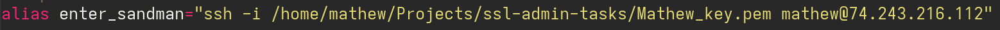

 

**3. Connecting to the VM**
By running the new `enter_sandman` command, I can instantly initiate a secure shell connection to the remote Ubuntu environment.

 View Screenshot

 

**4. System Package Updates**
Once logged in, the first step for system security is to update the system packages. I ran `sudo apt update && sudo apt upgrade` to fetch and install the latest package versions.

 View Screenshot

 

**5. Installing Unattended Upgrades**
[cite_start]To ensure the system always receives the latest security updates automatically, I started by installing the required package using `sudo apt install unattended-upgrades`. [cite: 22]

 View Screenshot

 

**6. Installing a Text Editor**
To make editing configuration files on the server easier, I installed the `micro` text editor using `sudo apt install micro`.

 View Screenshot

 

**7. Accessing Update Configurations**
I then opened the core configuration file for automatic updates by running `micro /etc/apt/apt.conf.d/50unattended-upgrades`.

 View Screenshot

 

**8. Enabling Security Origins**
Inside this file, I ensured the `"${distro_id}:${distro_codename}-security"` line within the `Allowed-Origins` block was active. This tells the system to automatically apply critical security patches.

 View Screenshot

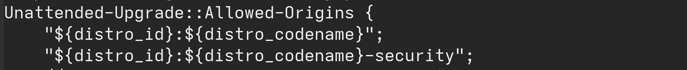

 

**9. Scheduling the Upgrades**
Next, I opened the periodic upgrades scheduling file by executing `micro /etc/apt/apt.conf.d/20auto-upgrades`.

 View Screenshot

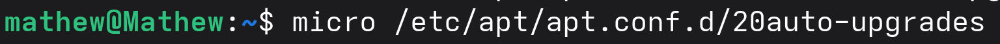

 

**10. Finalizing Periodic Rules**
Finally, I configured the `APT::Periodic` parameters. Setting `Update-Package-Lists` and `Unattended-Upgrade` to `"1"` ensures daily package list updates and the automatic installation of those security updates.

 View Screenshot

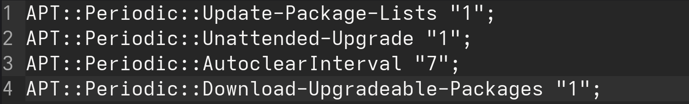

 

 

## 2. Enhanced SSH Security

**1. Securing SSH Configuration**
[cite_start]To lock down the server, I edited the SSH daemon configuration file to disable root login [cite: 25][cite_start], disable password-based authentication [cite: 26][cite_start], and explicitly enable public key authentication[cite: 27]. [cite_start]Additionally, I restricted SSH access to a specific IP range (`172.21.*.*`) for the user `mathew` using the `Match Address` and `AllowUsers` directives[cite: 28].

 View Screenshot

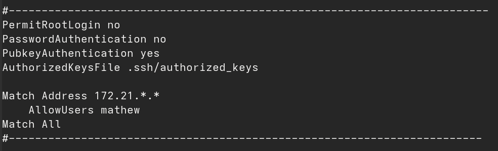

 

**2. Testing the Configuration**
Before applying the changes, I ran `sudo sshd -t` to test the configuration file for any syntax errors to prevent locking myself out.

 View Screenshot

 

**3. Restarting the SSH Service**
With the configuration verified, I restarted the SSH daemon using `sudo systemctl restart ssh` to apply the new security rules.

 View Screenshot

 

**4. Verifying Access**
I opened a new terminal session and executed the SSH command to ensure I could still successfully log into the VM with the new restrictions in place.

 View Screenshot

 

**5. Installing Fail2ban**
[cite_start]To protect the server against brute-force attacks[cite: 29], I installed `fail2ban` using the command `sudo apt-get install fail2ban`.

 View Screenshot

 

**6. Creating a Local Jail Configuration**
Instead of editing the default configuration file directly, I copied `jail.conf` to a new file named `jail.local` using `sudo cp /etc/fail2ban/jail.conf /etc/fail2ban/jail.local` to ensure my custom rules persist through updates.

 View Screenshot

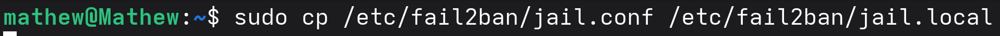

 

**7. Editing the Fail2ban Rules**
I opened the newly created `jail.local` file using `micro` to configure the specific protections for the SSH service.

 View Screenshot

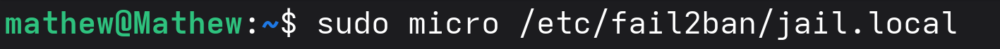

 

**8. Configuring the SSH Jail**
Inside the configuration file, I located the `[sshd]` block, set `enabled = true`, and configured `maxRetry = 3`. This strictly limits the number of failed login attempts to three before an IP is banned.

 View Screenshot

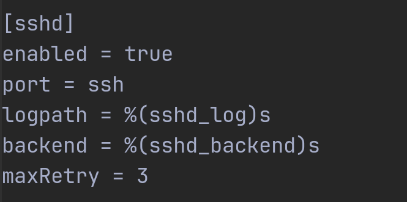

 

**9. Installing MFA Tools (Optional Task)**
[cite_start]To complete the optional Multi-Factor Authentication task [cite: 31][cite_start], I installed the Google Authenticator PAM module using `sudo apt install libpam-google-authenticator`[cite: 32].

 View Screenshot

 

**10. Configuring PAM for MFA**
Finally, I opened the PAM configuration file for SSH (`/etc/pam.d/sshd`) to integrate Google Authenticator, ensuring that the system will prompt for an MFA code during the login process.

 View Screenshot

 

**11. Enforcing MFA in PAM**
Inside the `/etc/pam.d/sshd` configuration file, I added the line `auth required pam_google_authenticator.so`. This ensures that the PAM module strictly enforces the Google Authenticator check during the login process.

 View Screenshot

 

**12. Applying PAM Configuration**
After saving the changes to the PAM configuration, I ran `sudo systemctl restart sshd.service` to apply the new rules to the SSH daemon.

 View Screenshot

 

**13. Modifying SSH Daemon Config for MFA**
Next, I needed to configure SSH to allow the challenge-response authentication that MFA relies upon. I opened the main SSH configuration file again using `sudo micro /etc/ssh/sshd_config`.

 View Screenshot

 

**14. Enabling Challenge-Response**
Inside the `sshd_config` file, I located the appropriate section and set `ChallengeResponseAuthentication yes`. This is the setting that actually allows the SSH server to prompt the user for the verification code generated by the Google Authenticator app.

 View Screenshot

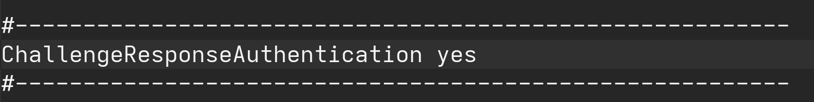

 

**15. Starting and Enabling Fail2ban**
Finally, to make sure the brute-force protection is actively running and will automatically start up if the server reboots, I executed `sudo systemctl start fail2ban && sudo systemctl enable fail2ban`.

 View Screenshot

 
 

## 3. Firewall and Network Security

**1. Accessing UFW Default Configuration**
To begin configuring the firewall, I opened the default UFW configuration file using `sudo micro /etc/default/ufw`.

 View Screenshot

 

**2. Enabling IPv6 Support**
Inside the configuration file, I ensured that `IPV6=yes` was set so that the firewall rules would apply to both IPv4 and IPv6 traffic.

 View Screenshot

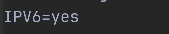

 

**3. Denying Incoming Traffic**
Following the requirements to secure the network, I set the default UFW policy to deny all incoming connections using `sudo ufw default deny incoming`.

 View Screenshot

 

**4. Allowing Outgoing Traffic**
To ensure the server can still reach the internet for updates and other outbound requests, I set the default policy for outgoing traffic to allow using `sudo ufw default allow outgoing`.

 View Screenshot

 

**5. Checking Available Applications**
Before applying specific rules, I ran `sudo ufw app list` to see which application profiles UFW already had registered, confirming `OpenSSH` was available.

 View Screenshot

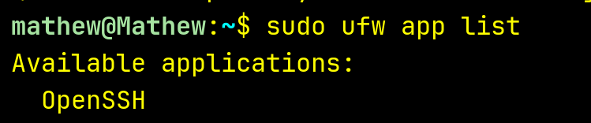

 

**6. Allowing OpenSSH Profile**
To prevent locking myself out, I explicitly allowed the OpenSSH application profile through the firewall using `sudo ufw allow OpenSSH`.

 View Screenshot

 

**7. Allowing the SSH Service**
As a redundancy for standard SSH access, I also ran `sudo ufw allow ssh` to ensure the service port is open.

 View Screenshot

 

**8. Allowing Port 22**
To be absolutely certain standard SSH traffic is permitted before switching ports, I allowed port 22 directly using `sudo ufw allow 22`.

 View Screenshot

 

**9. Allowing Non-Default SSH Port**
Per the task instructions to allow SSH on a non-default port, I opened port 2222 using the command `sudo ufw allow 2222`.

 View Screenshot

 

**10. Enabling UFW Logging**
Finally, I enabled firewall logging for auditing purposes by running `sudo ufw logging on`.

 View Screenshot

 

**11. Activating the Firewall**
To apply all the configured rules and activate the protection, I enabled UFW using `sudo ufw enable`.

 View Screenshot

 

**12. Verifying Firewall Status**
I ran `sudo ufw status verbose` to confirm that the firewall was active and that all the specific rules (deny incoming, allow outgoing, port 2222, etc.) were properly registered.

 View Screenshot

 

**13. Installing Suricata (IDS)**
For the optional Intrusion Detection System task, I added the official OISF repository and installed Suricata along with `jq` for log parsing using `sudo apt install suricata jq`.

 View Screenshot

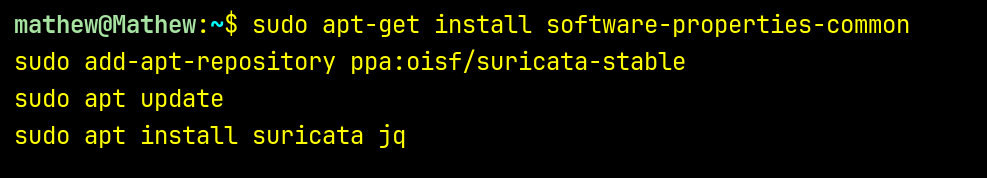

 

**14. Identifying Network Interfaces**
Before configuring Suricata, I used the `ip addr` command to identify the primary network interface (like `eth0`) that the IDS needs to monitor for traffic.

 View Screenshot

 

**15. Configuring Home Network**
I edited the Suricata configuration file (`/etc/suricata/suricata.yaml`) to define the `HOME_NET` variable, specifying the exact IP ranges the system needs to protect.

 View Screenshot

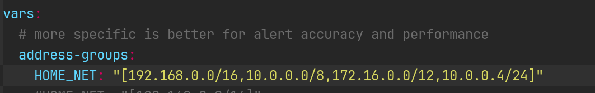

 

**16. Setting the Capture Interface**
Further down in the `suricata.yaml` configuration file, I updated the `af-packet` section to bind Suricata to the correct network interface (`eth0`) identified earlier.

 View Screenshot

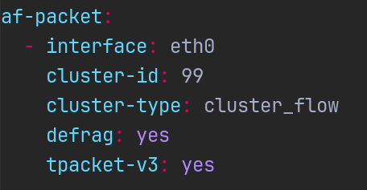

 

**17. Updating Suricata Rules**
To ensure the IDS can detect the latest known threats and suspicious activities, I downloaded and updated the rulesets by running `sudo suricata-update`.

 View Screenshot

 

**18. Restarting and Verifying Suricata**
I restarted the service with `sudo systemctl restart suricata` to apply the changes, and then checked the end of the log file using `sudo tail /var/log/suricata/suricata.log` to verify it initialized without errors.

 View Screenshot

 

**19. Enhancing UFW Logging**
To improve auditing capabilities as requested, I checked the current UFW logging level and increased it for more detailed tracking by running `sudo ufw logging medium`.

 View Screenshot

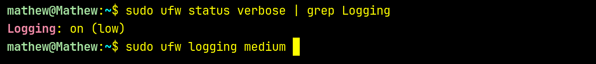

 
 

## 4. User and Permission Management

 
 

## 5. Web Server Deployment and Secure Configuration

 
 

## 6. Database Security

 
 

## 7. VPN Configuration

 
 

## 8. Docker Fundamentals and Personal Website Deployment

 
 
